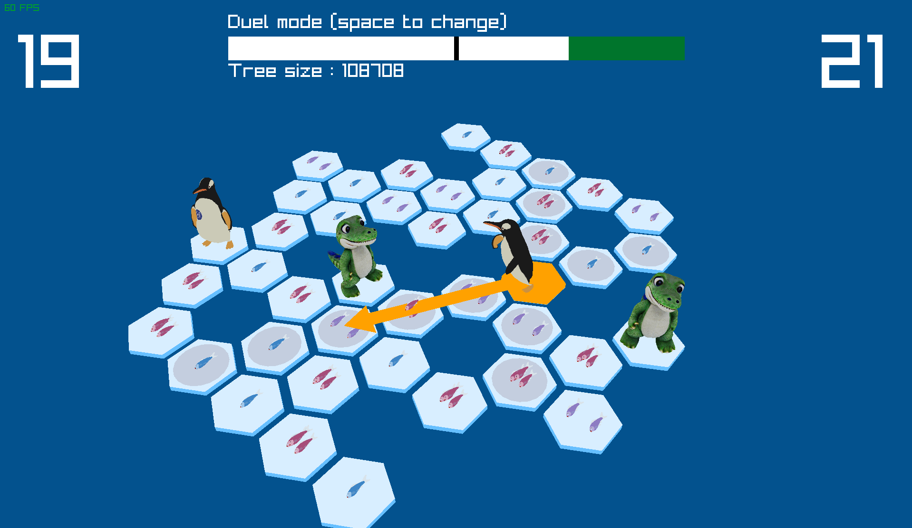

# Penguin game with Monte-Carlo Tree Search



## Short description

This is a C implementation of the amazing tabletop game [Hey, that's my fish !](https://www.fantasyflightgames.com/en/products/hey-thats-my-fish/) using the [Raylib](https://www.raylib.com/) library. The goal of this project is to showcase the efficiency of the Monte-Carlo Tree Search algorithm on these kind of games.

## How to play

### Rules
The goal of the game is to collect the highest number of fishes. Each turn a player shall select one of his two pieces and move it to another tile that can be reached in a straight line. The previous tile shatters, and the player immediatly collects the fishes of the new tile.

### Controls
Pieces can be moved by left clicking with the mouse. The A key reveals details such as the board evaluation by the AI. The game mode can be changed with the space key. Left and right arrows turn the camera around. D makes the pieces dance.
## Install guide

The only requirement is to install Raylib, which can easily be done in two steps.

### 1) Install required libraries for Raylib

ALSA for audio, Mesa for OpenGL accelerated graphics and X11 for windowing system.

##### Ubuntu
    sudo apt install libasound2-dev libx11-dev libxrandr-dev libxi-dev libgl1-mesa-dev libglu1-mesa-dev libxcursor-dev libxinerama-dev libwayland-dev libxkbcommon-dev

##### Fedora
    sudo dnf install alsa-lib-devel mesa-libGL-devel libX11-devel libXrandr-devel libXi-devel libXcursor-devel libXinerama-devel libatomic

##### Arch Linux
    sudo pacman -S alsa-lib mesa libx11 libxrandr libxi libxcursor libxinerama

##### Void Linux
    sudo xbps-install alsa-lib-devel libglvnd-devel libX11-devel libXrandr-devel libXi-devel libXcursor-devel libXinerama-devel mesa MesaLib-devel

### 2) Install Raylib

With your package manager:

##### openSUSE
```
zypper in raylib-devel
```

##### Fedora
```
dnf install raylib
```

##### Arch Linux
```
pacman -S raylib
```

##### Other distros
You can directly download the latest version from [the official Raylib repo](https://github.com/raysan5/raylib/releases) (named raylib-<version>_linux_amd64.tar.gz). Untar the folder, cd to the extracted folder and move it manually to the /usr directory.
```
sudo cp -r ./* /usr/
```

That should be it !

## How to launch the game

Go to the src folder where the makefile is located.

```
cd src/
```
Use make to compile the game.
```
make
```
Have fun !
```
./penguins
```

## A deeper look at the project

This project is made of four files :
- **board.c** implements the core of the game and its rules,
- **render.c** allows to display the current state of the game to a 3D environment and interact with the board using the Raylib library,
- **monte-carlo.c** is a minimal implementation of the Monte-Carlo Tree Search algorithm,
- **main.c** glues all theses files together.

To save space, the Monte-Carlo tree does not store the boards of each position, but only the *moves* to reach them. The exploration-exploitation constant at the beginning of **monte-carlo.c** can be changed to drastically modify the AI behaviour. A bigger value leads to more careful exploration, which almost becomes a breadth-first search if the constant is huge. A smaller value favors the deeper analysis of the best found moves, spending more time to elaborate a follow-up strategy. This results in a more tactical way of playing the game, at the cost of missing some moves that can surprise the AI and flip the game. If you want to make the AI stronger, the best bet is to increase its thinking time in the **main.c** file. If the game is not reaching 60FPS, you may reduce the number of tree descents by changing NB_TREE_STEPS in **main.c**.

## Coming soon
- Playing the game until the very end
- Better board evaluation by computing connected components
- Multi-threading (for an incoming practical session with students)
- Custom map loader
- Music

## 3D models

Make sure to thank the 3D modelling community for these beautiful free 3D models !

#### Low poly fish by Marcus Vinicius
https://sketchfab.com/3d-models/low-poly-fish-372cf57211e2429bb53e9863fc603596

#### Alligator character by fairblay96
https://www.cgtrader.com/free-3d-models/animals/reptile/alligator-character-a-pose-crocodile

#### Low Poly penguin by ibryn
https://www.cgtrader.com/free-3d-models/animals/bird/npr-animal-penguin